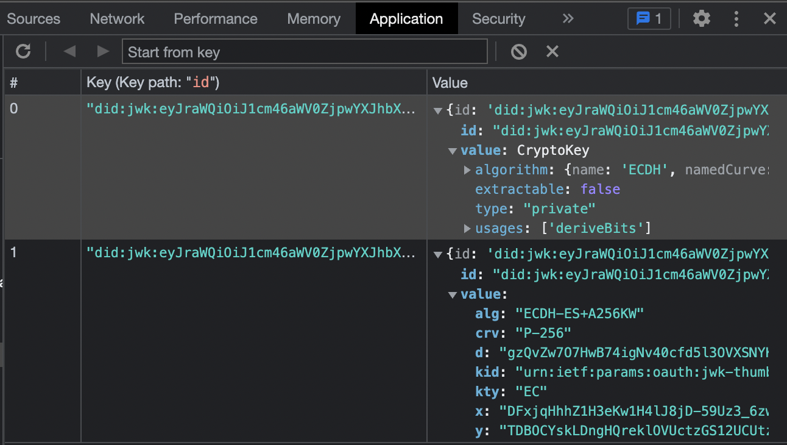

# Gladstone

A javascript wrapper around IndexDB.

Useful for storing JSON documents and Web Crypto Keys.


```js
const store = await gladstone('Wallet').open('Keys');
await store.set('DID_URL', CryptoKey);
\`\`\`



## Open Issues

- [Safari iOS PWA Data Persistence Beyond 7 Days](https://developer.apple.com/forums/thread/710157)